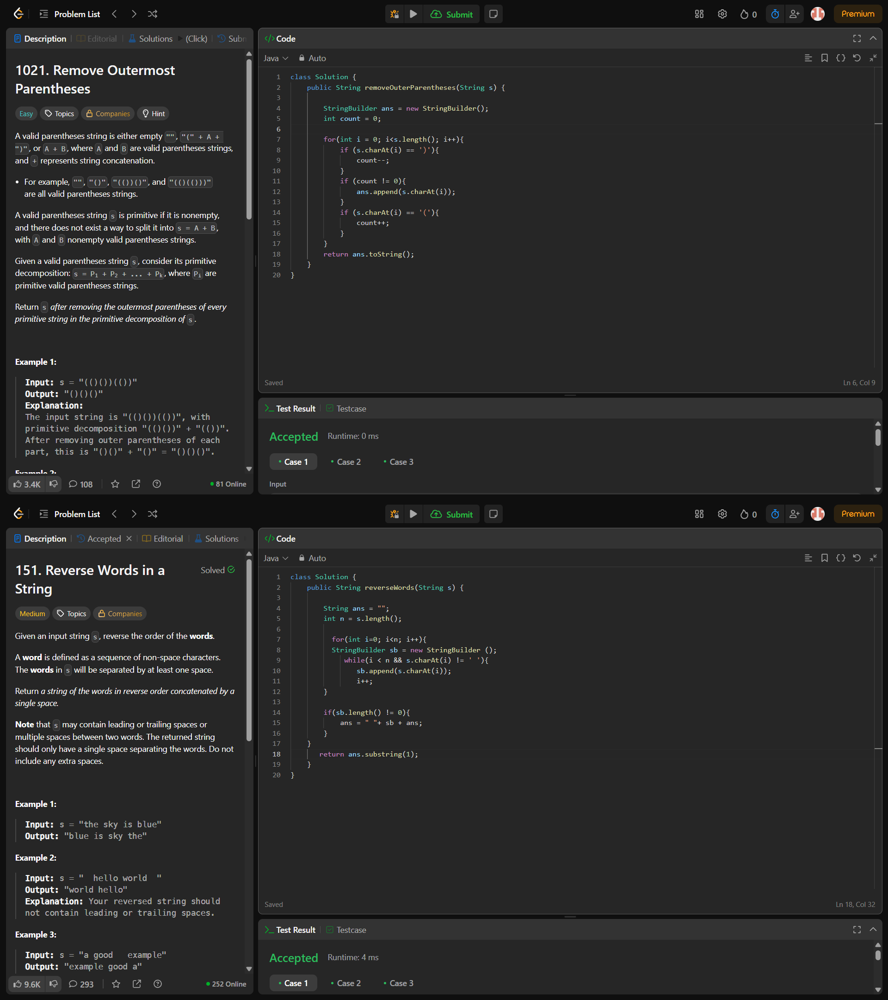

# Day 11 - #100DaysOfCode Challenge

## Topic: Strings

Today, I solved two interesting problems from the **Strings** chapter on LeetCode using Java:

### 🔹 Problems Solved:
1. **1021. Remove Outermost Parentheses**
   - Removes the outermost parentheses of each primitive valid substring.
   - Used counter logic to track depth.

2. **151. Reverse Words in a String**
   - Reverses the order of words in a given string.
   - Carefully handled extra spaces between/around words.

### 💡 Concepts Used:
- String manipulation
- Stack simulation (via count tracking)
- Two-pointer traversal
- Java StringBuilder

---

### ✅ Learning:
Practicing these problems helped strengthen my understanding of how to manipulate string structures, especially dealing with word boundaries and bracket pairs.

