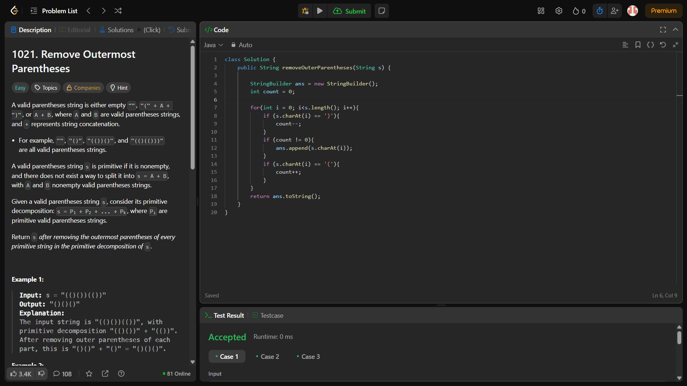
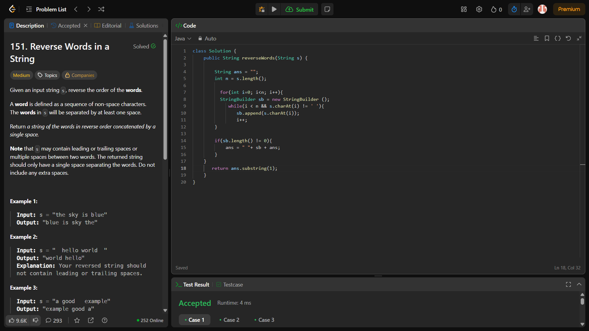

### 🚀 Day 12 - #100DaysOfCode Challenge

📅 Date: **18 July 2025**  
📁 Folder: `Day 12 - String Problems`

---

### ✅ Problems Solved Today:

1. **Longest Common Prefix**  
2. **Largest Odd Number in String**

---

### 🔹 Language: `Java`  
### 🔹 Topic: `Strings`

---

### 💡 Problem 1: Longest Common Prefix  
Finds the longest prefix common to all strings in a given array.

> **Concepts Used:**  
> - Prefix trimming  
> - `startsWith()` method  
> - Edge case handling for no common prefix

📷 Screenshot:  

---

### 💡 Problem 2: Largest Odd Number in String  
Finds the largest substring from the beginning that ends at an odd digit.

> **Concepts Used:**  
> - String iteration from end  
> - Character digit check with `% 2`

📷 Screenshot:  

---

### 📌 Key Takeaway:

Understanding string traversal, prefix trimming, and character handling in Java helped solidify fundamental string manipulation techniques.

---

🔗 [My LeetCode Profile](https://lnkd.in/dHhMN4i3)
