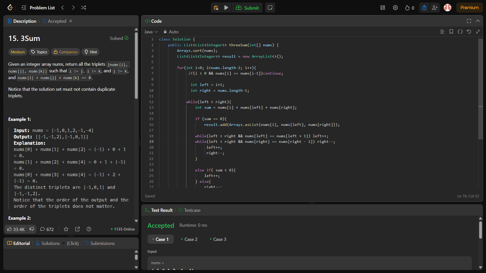

# Day 15 - #100DaysOfCode Challenge

## Problem: 3Sum (LeetCode 15)
- **Difficulty**: Medium
- **Language**: Java
- **Topic**: Two Pointers, Sorting

### 💡 Problem Summary:
Given an integer array `nums`, return all the triplets `[nums[i], nums[j], nums[k]]` such that:
- i != j, i != k, and j != k
- nums[i] + nums[j] + nums[k] == 0

Triplets must not contain duplicates.

### ✅ Solution Approach:
- Sort the array.
- Fix one element, and use two-pointer approach to find the remaining two elements.
- Skip duplicates to avoid repeating triplets.

```java
class Solution {
    public List<List<Integer>> threeSum(int[] nums) {
        Arrays.sort(nums);
        List<List<Integer>> result = new ArrayList<>();

        for (int i = 0; i < nums.length - 2; i++) {
            if (i > 0 && nums[i] == nums[i - 1]) continue;

            int left = i + 1;
            int right = nums.length - 1;

            while (left < right) {
                int sum = nums[i] + nums[left] + nums[right];

                if (sum == 0) {
                    result.add(Arrays.asList(nums[i], nums[left], nums[right]));
                    while (left < right && nums[left] == nums[left + 1]) left++;
                    while (left < right && nums[right] == nums[right - 1]) right--;
                    left++;
                    right--;
                } else if (sum < 0) {
                    left++;
                } else {
                    right--;
                }
            }
        }
        return result;
    }
}
```

### 📷 Screenshot:

