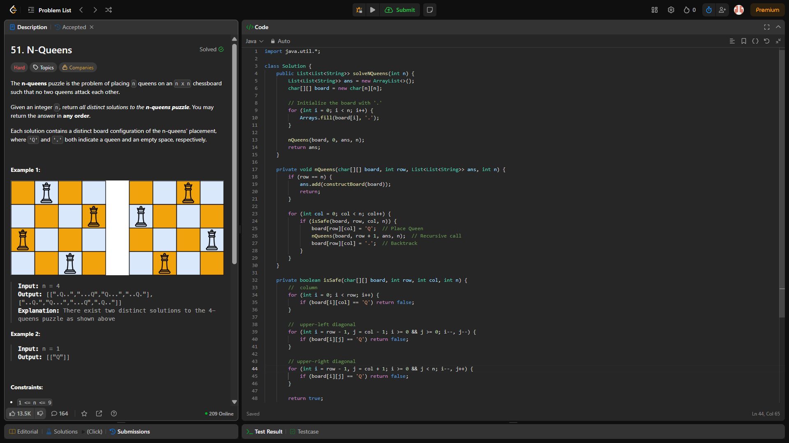

# Day 22 – N-Queens Challenge 🧠♟️

## Problem:
Implement the classic N-Queens challenge using backtracking.

### 🔹 Problem Link:
[LeetCode – N-Queens (#51)](https://leetcode.com/problems/n-queens/)

### 🔹 Language:
Java

### 🔹 Topics:
Backtracking, Recursion, Constraints, Chessboard Traversal

### 🔹 Key Takeaways:
- Use backtracking to build all valid queen placements
- Check for column and both upper diagonals before placing a queen
- Use a 2D board and convert the result to a readable format
- Understand how recursion and constraint propagation works together

### 🧠 What I Learned:
- Recursive base-case driven board construction
- Diagonal safety checks using index math
- Classic application of DFS in combinatorial board problems

---

### 📅 Progress: Day 22 of #100DaysOfCode
